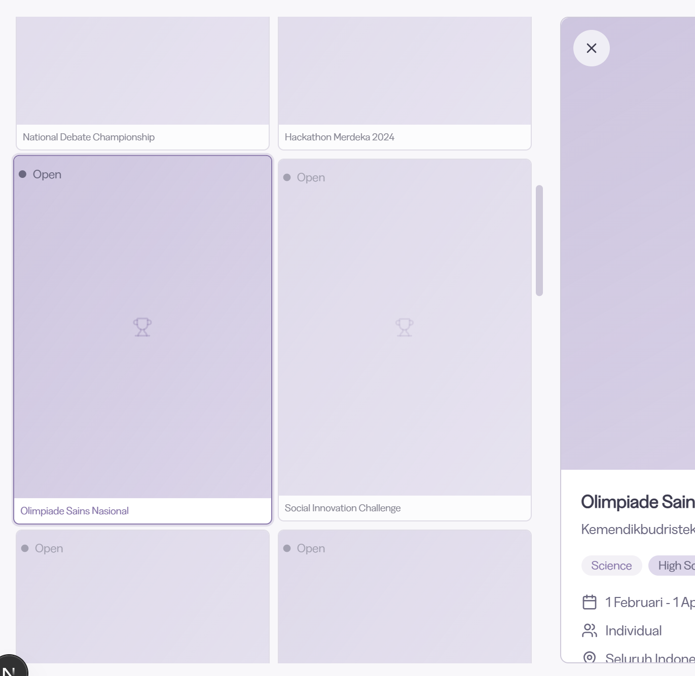

# task todo

## phase 0

- [x] **sesuaikan lagi skema database nya supaya ringkas, tapi informasinya lengkap juga** 
- [x] perbaiki header di mobile, supaya di mobile pake drawer di samping kanan 
- [x] sesuaikan terms and privacy, untuk mengatur penggunaan website dan melindungi pemilik website
- [x] hilangin pemilihan kategori di heroes, supaya mempermudah user buat mencari lomba
- [ ] **sesuaikan lagi skema database nya dengan data scrapping**
- [x] **tentuin konten wa dan threads**
- [ ] **tentuin decision pop up poster untuk experience yang paling nyaman**
- [ ] ~~perbaiki header di mobile, supaya di mobile pake drawer di samping kanan~~
- [ ] *sesuaikan terms and privacy, untuk mengatur penggunaan website dan melindungi pemilik website
- [ ] *nulis about me
- [ ] ~~*kategori cuman di teknologi aja dulu~~
- [ ] *hilangin pemilihan kategori di heroes, supaya mempermudah user buat mencari lomba
- [ ] di kategori/competition disesuaikan supaya mirip dgn luma, terdapat banner gambar yang bisa dicustom, pakai gambar gratisan dari unsplash aja
- [x] **sesuaikan component poster di mobile supaya experience nya dapet: cepat, lengkap dan informatif** 
- [x] di mobile poster bisa di tahan untuk muncul pop up seperti di instagram 
- [ ] penyesuaian teks di section heroes yang pas secara marketing, berapa tambahan lomba per minggu
- [ ] tambahkan report page per component, untuk orang lain dapat memberikan kritik (card poster)
- [ ] tombol share dan tombol claim this competition dan logo report (card poster)
- [ ] integrasi posthog/umami di beberapa interaksi penting
- [ ] implementasi featurebase untuk customer feedback
- [x] randomize perbaikin supaya ngambil data dari lomba 
- [x] footernya 
- [x] sorting nya yang terbaru dan by nama
- [x] terapin sistem toggle theme nya 
- [ ] **tentuin decision pop up poster untuk experience yang paling nyaman** 
- [x] tombol share nya pake component yg bagus 
- [ ] siapin tempat/component buat ads 
- [ ] randomize perbaikin supaya ngambil data dari lomba

card component lomba bakal ada 3 bentuk:
- card + poster
- card without poster
- list

## phase 1

- [ ] list resources untuk support lomba, beasiswa, event, yg unik dan potensial dijadikan partner
- [ ] footernya 
- [ ] *siapin tempat/component buat ads
- [ ] 

## phase 2

- [ ] open status ?penting kah
- [ ] tambahkan claim institusi untuk mengelola sendiri 
- [ ] customer feedback, 
- [ ] institution feedback
- [ ] penambahan fitur sesuai dgn user
- [ ] penyesuaian page khusus untuk institusi ?kata yang tepat apa yah, organizer apa institusi apa kampus
- [ ] newsletter tiap kategori lomba